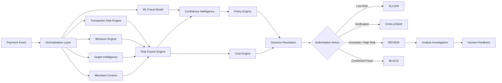

<div align="center">

# 🛡️ SentinelPay AI

### Explainable Payment Risk Intelligence — Before Money Moves.

**A multi-signal AI payment-risk platform that detects obvious fraud, hidden abuse networks, and uncertain transactions while balancing fraud loss, customer friction, and human oversight.**

<br/>


<br/>

**Rules · Behavioral Intelligence · Graph Detection · Machine Learning · Explainability · Cost Optimization · Human Oversight**

</div>

---

## 🚨 The Problem

Payment fraud is rarely just a single suspicious transaction.

Traditional fraud systems often evaluate payments individually using fixed rules or a standalone machine-learning model. But modern abuse can be coordinated across multiple accounts, devices, cards, IP addresses, merchants, and transaction patterns.

A transaction may appear perfectly normal in isolation while being part of a larger fraud network.

**SentinelPay was built to reason beyond the individual transaction.**

Instead of asking only:

> **“Does this payment look fraudulent?”**

SentinelPay also asks:

> **“How is this payment behaving, what is it connected to, how confident are we, what evidence supports the decision, and what intervention minimizes business loss?”**

---

# ⚡ What is SentinelPay?

**SentinelPay AI** is an explainable, multi-signal payment risk intelligence platform that evaluates a transaction before a final payment decision is made.

It combines:

- 🧾 Transaction rule intelligence
- 📈 Behavioral anomaly detection
- 🕸️ Relationship / abuse-ring intelligence
- 🏪 Merchant-context intelligence
- 🧠 Machine-learning fraud probability
- 🎯 Multi-signal risk fusion
- 💰 Expected-cost decision optimization
- 🔄 Counterfactual “What-if?” reasoning
- 📉 Fraud-spike and drift monitoring
- 🔐 Privacy-preserving identifier handling
- 👨‍💼 Human-in-the-loop investigation

The result is not merely a fraud probability.

SentinelPay produces an **authoritative, explainable payment-risk decision**.

---

# 🌟 Why SentinelPay Is Different

| Capability | What SentinelPay Adds |
|---|---|
| **Hybrid Risk Intelligence** | Combines rules, behavior, graph relationships, merchant context and ML rather than relying on one model |
| **Abuse-Ring Detection** | Detects shared devices, IP addresses, cards and identities across customer accounts |
| **Explainable Decisions** | Surfaces the concrete evidence responsible for an intervention |
| **Confidence Awareness** | Detects disagreement between risk signals and recommends human review when uncertainty is high |
| **Cost-Aware Decisioning** | Compares the expected business cost of ALLOW, CHALLENGE, REVIEW and BLOCK |
| **Counterfactual Reasoning** | Shows how the decision changes if risky characteristics are normalized |
| **Human Oversight** | Routes uncertain/high-risk transactions to an analyst investigation workflow |
| **Drift Intelligence** | Tracks changes in recent risk distributions and fraud spikes |
| **Privacy by Design** | Protects sensitive identifiers before exposing them to logs and analytical outputs |
| **Payment Integration** | Normalizes payment events through a Razorpay integration layer |

---

# 🧠 The Core Idea: Multi-Signal Risk Intelligence

A conventional fraud classifier can miss coordinated abuse when the individual payment itself looks normal.

SentinelPay evaluates multiple independent perspectives:

```text
                    ┌──────────────────────┐
                    │  Payment Transaction │
                    └──────────┬───────────┘
                               │
                               ▼
              ┌─────────────────────────────────┐
              │      SentinelPay Risk Layer     │
              └─────────────────────────────────┘
                   │        │       │       │
              ┌────▼───┐ ┌──▼───┐ ┌─▼────┐ ┌▼────────┐
              │ Rules  │ │Behavior│ │Graph │ │Merchant │
              └────┬───┘ └──┬────┘ └─┬────┘ └┬────────┘
                   │        │        │        │
                   └────────┴────┬───┴────────┘
                                 │
                           ┌─────▼─────┐
                           │Risk Fusion│
                           └─────┬─────┘
                                 │
                      ┌──────────▼──────────┐
                      │ ML + Confidence     │
                      │ + Cost Reasoning    │
                      └──────────┬──────────┘
                                 │
                    ┌────────────▼────────────┐
                    │ Authoritative Decision │
                    │ ALLOW / CHALLENGE /    │
                    │ REVIEW / BLOCK          │
                    └────────────┬────────────┘
                                 │
                       uncertain/high risk
                                 │
                                 ▼
                    ┌────────────────────────┐
                    │ Human Analyst Review   │
                    └────────────────────────┘
```

---

# 🔥 Demo Highlight — Detecting What ML Alone Misses

One of SentinelPay's strongest scenarios demonstrates why multi-signal reasoning matters.

### Coordinated Abuse-Ring Scenario

A transaction appears normal when examined individually:

| Signal | Result |
|---|---:|
| Transaction Risk | **0 / 100** |
| Behavioral Risk | **0 / 100** |
| ML Fraud Probability | **26.6%** |
| ML Prediction | **Non-fraud** |
| Graph Risk | **77 / 100** |
| Fused Risk | **75 / 100** |
| Final Risk Level | 🔴 **HIGH** |
| Authoritative Action | **REVIEW** |

Why?

SentinelPay discovers that the transaction's underlying identifiers are connected across multiple customer accounts:

```text
Device ───────► 4 customer accounts
IP Address ──► multiple customer accounts
Card ─────────► 4 customer accounts
```

The standalone ML signal does not classify the transaction as fraud.

**The relationship graph does.**

SentinelPay therefore escalates the payment to:

```text
HIGH RISK → HUMAN REVIEW
```

> **This is the central SentinelPay advantage: detecting coordinated abuse that may remain invisible when transactions are evaluated independently.**

---

# 🏗️ System Architecture



---

# 🕸️ Graph-Based Abuse Detection

Fraudsters can create multiple accounts while reusing infrastructure.

SentinelPay models relationships between:

```text
Customer
   │
   ├── Device
   ├── IP Address
   ├── Card Fingerprint
   └── Email Identity
```

This allows the platform to identify suspicious shared infrastructure and potential coordinated abuse rings.

Example evidence:

```text
Device is shared across 4 customer accounts
IP address is shared across several customer accounts
Card fingerprint is linked to 4 customer accounts
```

This relationship layer complements both transaction rules and ML predictions.

---

# 🔍 Explainable AI

A risk score without evidence is difficult to trust.

SentinelPay attaches human-readable evidence to its decisions.

For a high-risk transaction, the system may explain:

```text
• Transaction amount is at least 5× the customer's 30-day average
• Transaction originated from a new device
• Customer account is less than 7 days old
• Very high transaction velocity in the last hour
• Elevated transaction activity in the last 24 hours
```

For graph-based fraud:

```text
• Device shared across 4 customer accounts
• IP address shared across several accounts
• Card fingerprint linked to 4 customer accounts
```

This makes the decision suitable for analyst investigation rather than presenting a black-box probability alone.

---

# 💰 Cost-Aware Decision Intelligence

Fraud prevention is not simply about blocking everything suspicious.

Every intervention has a cost.

SentinelPay evaluates:

```text
ALLOW
CHALLENGE
REVIEW
BLOCK
```

against estimated business impact.

For example:

```text
ALLOW       ₹33,650.00
CHALLENGE   ₹11,780.77
REVIEW       ₹5,072.50   ← minimum expected cost
BLOCK       ₹16,350.00
```

The system can therefore distinguish between:

```text
Risk Recommended Action
          +
Cost Recommended Action
          ↓
Authoritative Action
```

This helps balance:

**Fraud loss ↔ Customer friction ↔ Review cost ↔ False-positive loss**

---

# 🔄 Counterfactual Risk Analysis

SentinelPay can also answer:

> **“What would have to change for this transaction to become safer?”**

Example:

| Scenario | New Risk | Risk Reduction |
|---|---:|---:|
| Known device | 50.3 | ↓ 17.0 |
| Mature account | 47.3 | ↓ 20.0 |
| Normal velocity | 41.5 | ↓ 25.8 |
| Normalized amount | 38.8 | ↓ 28.5 |
| Combined safer profile | 0.0 | ↓ 67.3 |

This transforms explainability from:

> “Why was I flagged?”

into:

> **“What factors actually drove the decision?”**

---

# 🎯 Decision Confidence & Human Oversight

SentinelPay does not pretend every automated decision is equally reliable.

It evaluates signal agreement and uncertainty.

Example:

```text
Transaction Risk     0
Behavior Risk        0
Graph Risk          77
Merchant Risk        0

Signal Agreement: WEAK
Decision Confidence: LOW
Uncertainty: 77/100

→ Human Review Recommended
```

High uncertainty therefore becomes a reason for **human escalation**, not blind automation.

---

# 👨‍💼 Analyst Review Workflow

Transactions requiring human intervention automatically enter the:

### Human Review Queue

Analysts can:

1. Open the transaction investigation.
2. Inspect fused risk and model confidence.
3. Review explainable evidence.
4. Compare SentinelPay's recommendation.
5. Make the final human decision.
6. Submit the review outcome back to SentinelPay.

Supported review outcomes include:

```text
FRAUD
LEGITIMATE
```

This creates a bounded AI workflow where automation assists the analyst without silently replacing human judgment.

---

# 💳 Razorpay Integration

SentinelPay includes a Razorpay integration layer for payment-event processing.

```text
Razorpay Payment Event
        │
        ▼
Webhook Verification
        │
        ▼
Razorpay Adapter
        │
        ▼
Normalized SentinelPay Transaction
        │
        ▼
Multi-Signal Risk Analysis
        │
        ▼
Authoritative Decision
```

Webhook secrets are loaded through environment configuration rather than hard-coded credentials.

> **Never commit Razorpay secrets or `.env` files to source control.**

---

# 🔐 Privacy by Design

Payment-risk systems operate on sensitive information.

SentinelPay reduces unnecessary exposure by protecting identifiers used for relationship intelligence.

Protected fields include:

```text
card_fingerprint
device_id
email_hash
ip_address
```

Privacy controls include:

- No raw card number storage
- No raw sensitive identifier logging
- SHA-256 based identifier protection/tokenization
- Environment-based secret configuration
- `.env` excluded from version control

---

# 📉 Drift & Fraud-Spike Monitoring

Risk patterns can change over time.

SentinelPay tracks operational indicators including:

```text
Recent Average Risk
High-Risk Ratio
Drift Status
Fraud Spike Detected
```

This provides the foundation for detecting changes in fraud behavior rather than assuming historical patterns remain permanently valid.

---

# 🖥️ SentinelPay Risk Command Center

The React dashboard turns backend risk intelligence into an analyst-friendly interface.

### Risk Command Center

Displays:

- Fused risk score
- Final risk level
- Authoritative action
- Decision confidence
- Multi-signal risk decomposition
- ML fraud probability
- Explainable evidence
- Policy resolution
- Expected business impact
- Drift and fraud-spike status

### Transaction Intelligence

Provides a history of analyzed transactions with:

```text
Transaction
Merchant
Risk Score
Risk Level
ML Probability
Final Action
```

### Human Review Queue

Automatically surfaces transactions requiring analyst intervention.

### Analyst Investigation

Provides evidence and final human-action controls for individual cases.

---

# 🧪 Demo Scenarios

SentinelPay includes several scenarios designed to demonstrate different types of risk.

### 🟢 Scenario 1 — Legitimate Transaction

```text
Rule Risk:       0
Behavior Risk:   0
Graph Risk:      0
Fused Risk:      0

Decision Confidence: HIGH
Final Action: ALLOW
```

Demonstrates that legitimate customers are not unnecessarily interrupted.

---

### 🔴 Scenario 2 — Obvious High-Risk Transaction

Signals include:

```text
25× historical transaction amount
New device
Young account
Very high transaction velocity
Abnormal 24-hour activity
```

Result:

```text
Rule Risk:        98
Behavior Risk:   100
ML Probability: 99.6%

Human Review Recommended
```

---

### 🕸️ Scenario 3 — Hidden Fraud Ring

The most important demonstration:

```text
Rule Risk:          0
Behavior Risk:      0
ML Probability: 26.6%
Graph Risk:        77

Fused Risk:        75
Risk Level:      HIGH
Action:         REVIEW
```

SentinelPay catches the coordinated relationship pattern even though the individual transaction and standalone ML prediction appear relatively safe.

---

# 🛠️ Technology Stack

### Backend

- Python
- FastAPI
- Pydantic
- Uvicorn

### Intelligence Layer

- Rule-based risk analysis
- Behavioral anomaly detection
- Relationship / graph analysis
- Machine-learning fraud classification
- Merchant-context analysis
- Risk fusion
- Decision-confidence analysis
- Cost optimization
- Counterfactual analysis
- Drift monitoring

### Frontend

- React
- Vite
- Responsive analyst dashboard

### Payments

- Razorpay integration
- Webhook verification and event normalization

### Engineering

- Pytest
- Git / GitHub
- Automated CI/CD workflow

---

# 📁 Project Structure

```text
sentinelpay-ai/
│
├── app/
│   ├── main.py
│   ├── risk_engine.py
│   ├── behavior_engine.py
│   ├── graph_engine.py
│   ├── fusion_engine.py
│   ├── cost_engine.py
│   ├── explainability_engine.py
│   ├── privacy_engine.py
│   ├── razorpay_adapter.py
│   └── razorpay_engine.py
│
├── frontend/
│   ├── src/
│   ├── public/
│   ├── package.json
│   └── vite.config.js
│
├── models/
│   └── sentinelpay_logreg.joblib
│
├── tests/
│   ├── test_api.py
│   ├── test_razorpay.py
│   └── test_razorpay_adapter.py
│
├── requirements.txt
├── Dockerfile
├── .gitignore
└── README.md
```

> Project structure may evolve as SentinelPay is extended.

---

# 🚀 Running SentinelPay Locally

## 1. Clone the repository

```bash
git clone https://github.com/Krithika-Sulochana-08/sentinelpay-ai.git
cd sentinelpay-ai
```

## 2. Create a Python virtual environment

### Windows

```powershell
python -m venv .venv
.\.venv\Scripts\Activate.ps1
```

### macOS / Linux

```bash
python3 -m venv .venv
source .venv/bin/activate
```

## 3. Install backend dependencies

```bash
pip install -r requirements.txt
```

## 4. Start the API

```bash
uvicorn app.main:app --reload --port 8080
```

The backend will run locally on port `8080`.

Interactive FastAPI documentation is available at:

```text
http://127.0.0.1:8080/docs
```

## 5. Start the frontend

Open another terminal:

```bash
cd frontend
npm install
npm run dev
```

Open the local URL displayed by Vite.

---

# 🧪 Running Tests

From the project root:

```bash
python -m pytest -q
```

Current verified test result:

```text
.............                                            [100%]

13 passed
```

The frontend production build can be verified with:

```bash
cd frontend
npm run build
```

---

# 📡 API Capabilities

SentinelPay exposes APIs for the core payment-risk workflow, including:

```text
Health / service status
Transaction risk analysis
Razorpay payment-event processing
Human review feedback
```

For the exact request/response schemas, start the backend and open:

```text
http://127.0.0.1:8080/docs
```

---

# 🔮 Roadmap

SentinelPay's next production-oriented milestones include:

- [ ] Persistent transaction and review database
- [ ] Production graph database for large-scale relationship intelligence
- [ ] Real-time event streaming
- [ ] Merchant-specific model calibration
- [ ] Continuous ML retraining from analyst feedback
- [ ] Advanced model-drift monitoring
- [ ] Role-based analyst authentication
- [ ] Expanded audit trails
- [ ] Production cloud deployment
- [ ] Large-scale fraud-ring visualization
- [ ] Additional payment-provider integrations

---

# 🎥 Demo

**Demo video coming soon.**

The demonstration will cover:

```text
Legitimate Payment
        ↓
ALLOW

Obvious High-Risk Payment
        ↓
REVIEW

Hidden Abuse Ring
        ↓
Graph Intelligence
        ↓
HIGH RISK
        ↓
Human Investigation
        ↓
Final Analyst Decision
```

---

# 💡 Vision

SentinelPay is built around a simple principle:

> **Payment risk should not be decided by a single score.**

Effective fraud prevention requires understanding the transaction, the customer's behavior, the surrounding relationship network, model uncertainty, merchant context, business impact, and the evidence behind every intervention.

**SentinelPay brings those signals together before money moves.**

---

<div align="center">

### 🛡️ SentinelPay AI

**Detect the transaction. Understand the network. Explain the risk. Protect the payment.**

Built for intelligent, explainable and human-centered payment risk decisioning.

⭐ **If you find SentinelPay interesting, consider starring the repository.**

</div>
